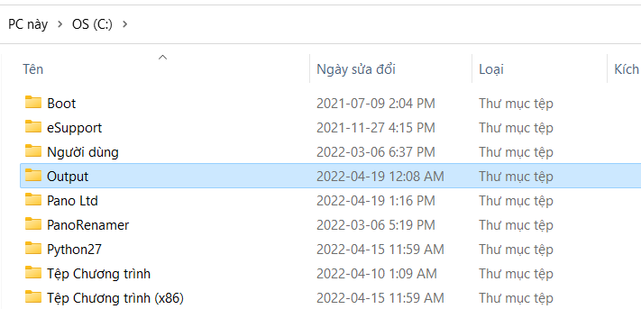

# Tạo Database Arcmap bằng Python
----------
&nbsp;
## 1: Tạo folder Output trong ổ C:
&nbsp;

\
&nbsp;
## 2: Mở cửa sổ thực thi Python trong Arcmap:
&nbsp;
\

&nbsp;
\
&nbsp;
\

&nbsp;
## 3: Tại cửa sổ Python thực thi từng lệnh: